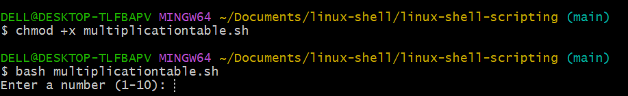
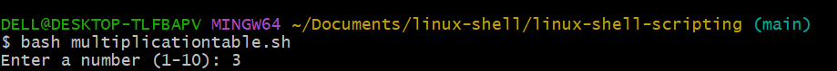

# linux-shell-scripting

## Table of Contents

1. Project Overview
2. Project Steps and Commands
   
   2.1 Create Project Directory

   2.2 Initialize Git Repository

   2.3 Create the Bash Script File (.sh)

   2.4 Make the Script Executable

3. Script Implementation Steps
   
   3.1 Prompt for User Input

   3.2 Ask for Table Type (Full or Partial)

   3.3 Full Multiplication Table

   3.4 Partial Multiplication Table

   3.5 Validate Input Range for Partial Table

   3.6 Handle Invalid Options

4. Troubleshooting (Common Issues and Solutions)

# 📌 Project Overview
This capstone project demonstrates Linux shell scripting skills by creating a dynamic Multiplication Table Generator using Bash scripting. The project follows structured development with Git for version control and showcases best practices in shell scripting, input validation, and troubleshooting.

## 📌Project Steps and Commands
### 2.1 Create Project Directory

`mkdir linux-shell && cd linux-shell`

### 2.2 Initialize Git Repository

`git init`

### 2.3 Create the Bash Script File (.sh)

`touch multiplicationtable.sh`

`vim multiplicationtable.sh`

### 2.4 Make the Script Executable
`chmod +x multiplication`

# ->Script Implementation Steps

### 3.1 Prompt for User Input
`echo "Enter a number: "`

`read number`

### 3.2 Ask for Table Type (Full or Partial)

`echo "Choose: (1) Full Table (2) Partial Table"`
`read choice`

### 3.3 Full Multiplication Table
`for i in {1..10}
do
echo "$number x $i = $(($number * $i))"
done`

### 3.4 Partial Multiplication Table

``echo "Enter start range:"
read start``

``echo "Enter end range:"
read end``

``for i in $(seq $start $end)
do
echo "$number x $i = $(($number * $i))"
done``

### 3.5 Validate Input Range for Partial Table

``if [[ $start -gt $end ]]; then
echo "Invalid range! Start must be less than or equal to End."
exit 1
fi``

### 3.6 Handle Invalid Options
``if [[ $choice -ne 1 && $choice -ne 2 ]]; then
echo "Invalid choice. Please enter 1 or 2."
exit 1
fi``

## Troubleshooting (Common Issues and Solutions)

### ❗ 4.1 Script Permission Denied

Issue: "Permission Denied" when running the script.

✅ Solution:

``
chmod +x multiplication_table.sh``

### ❗ 4.2 Invalid Input for Number

Issue: Non-numeric values break the script.

✅ Solution: Add input validation:

``if ! [[ "$number" =~ ^[0-9]+$ ]]; then
echo "Invalid input. Enter a number."
exit 1
fi``

### ❗ 4.3 Git Remote Connection Issues
Issue: Unable to push code to GitHub.

✅ Solution:

``git remote -v``

``git remote add origin <repository_url>``

``git push -u origin main``

🎯 Conclusion
This capstone project demonstrates proficiency in Linux shell scripting, Git version control, and troubleshooting Bash scripts. By implementing structured Bash scripts with input validation and error handling, the project highlights best practices in automation and scripting for DevOps.

🚀 Next Steps: Enhance the script with logging, error tracking, and automation features.

